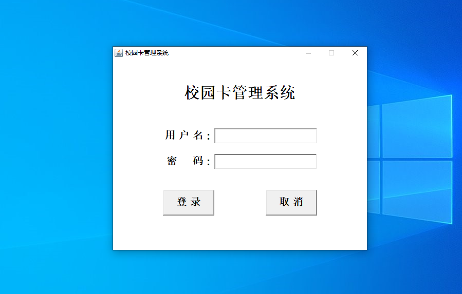
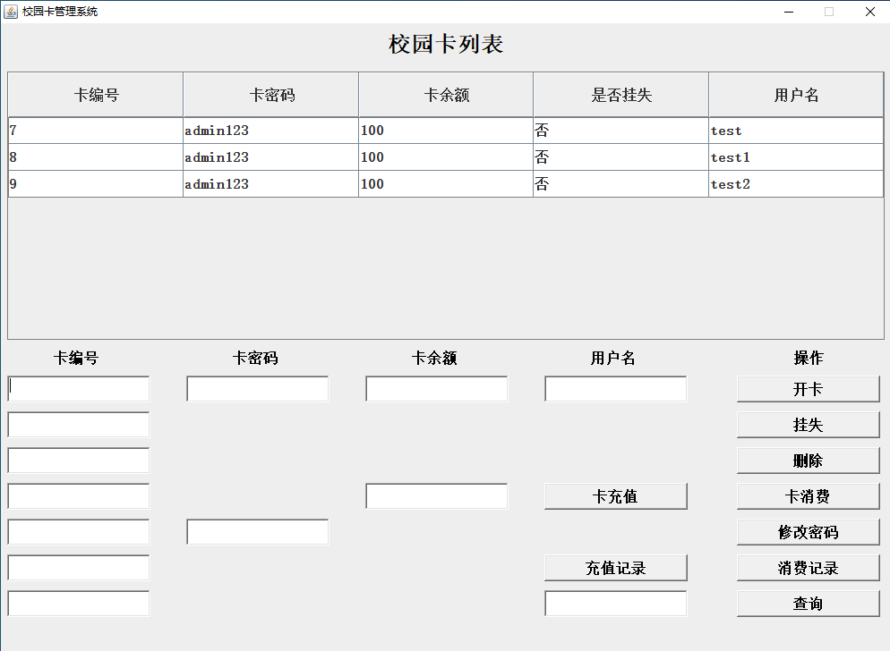
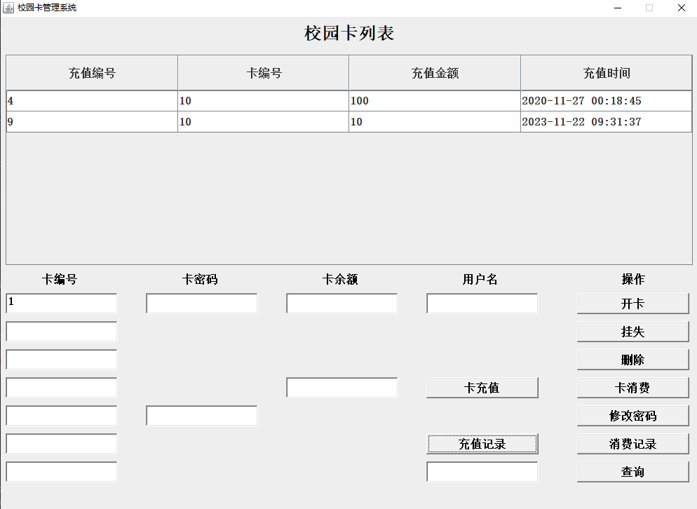
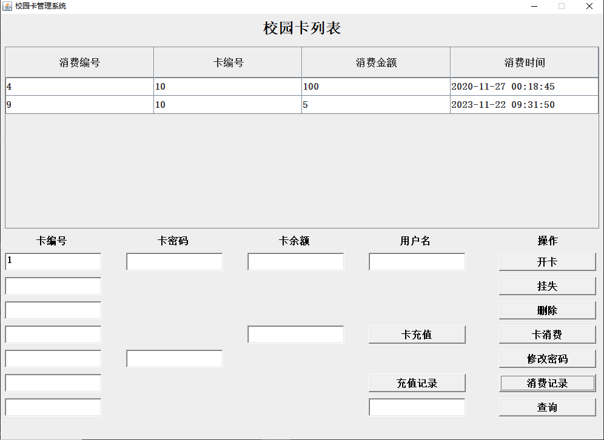

<h1 align="center">22.基于swing的校园卡管理系统</h1>

- <b>完整代码获取地址：从戎源码网 ([https://armycodes.com/](https://armycodes.com/))</b>
- <b>技术探讨、资料分享，请加QQ群：692619798</b> 
- <b>作者微信：19941326836  QQ：952045282</b> 
- <b>承接计算机毕业设计、Java毕业设计、Python毕业设计、深度学习、机器学习</b>
- <b>选题+开题报告+任务书+程序定制+安装调试+论文+答辩ppt 一条龙服务</b>
- <b>所有选题地址 ([https://github.com/YuLin-Coder/AllProjectCatalog](https://github.com/YuLin-Coder/AllProjectCatalog)) </b>

## 简介

> 本代码来源于网络,仅供学习参考使用!
>
> 用户名: admin  密码: 123456
> 
> 注意： 界面出现乱码的话，环境变量中添加-Dfile.encoding=GB18030
> 
>------------------------------------------------------------------------------------------------------------------------
>一. schoolcard.txt文档相等于校园卡的数据表.

    第一列: 校园卡主键
    第二列: 校园卡密码
    第三列: 校园卡余额
    第四列: 校园卡挂失(1:挂失,0:未挂失)
    第五列: 校园卡用户名
    第六列: 校原卡是否已删除(1:删除,0:未删除)

>------------------------------------------------------------------------------------------------------------------------
>二. credit.txt文档相等于充值的数据表.

    第一列: 充值记录主键
    第二列: 校园卡主键
    第三列: 校园卡充值金额
    第四列: 校园卡充值时间

------------------------------------------------------------------------------------------------------------------------
>三. consume.txt文档相等于消费的数据表.

    第一列: 消费记录主键
    第二列: 校园卡主键
    第三列: 校园卡消费金额
    第四列: 校园卡消费时间
>------------------------------------------------------------------------------------------------------------------------

## 环境

- <b>IntelliJ IDEA 2009.3</b>

- <b>JDK 1.8</b>

## 运行截图

